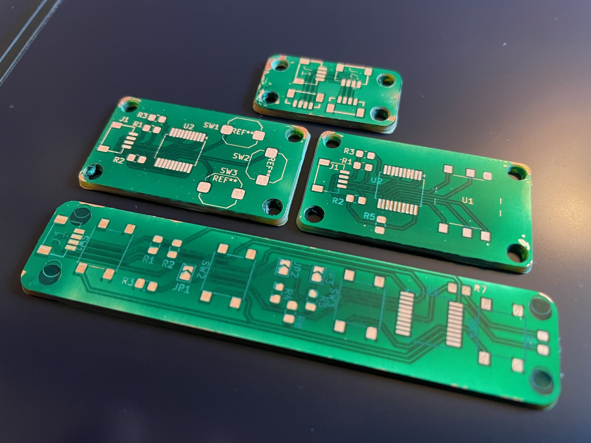
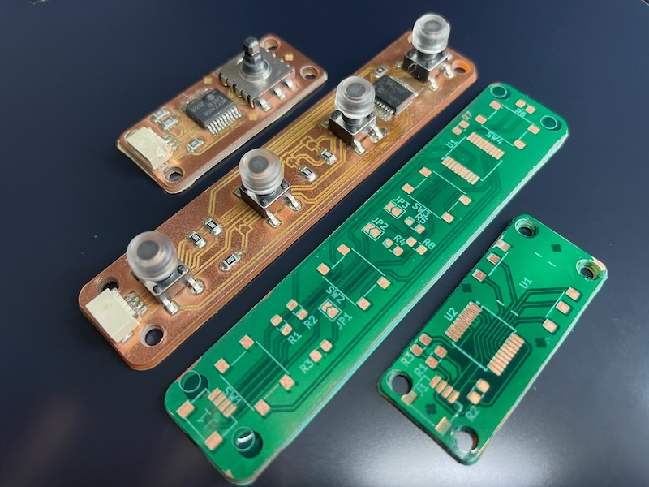
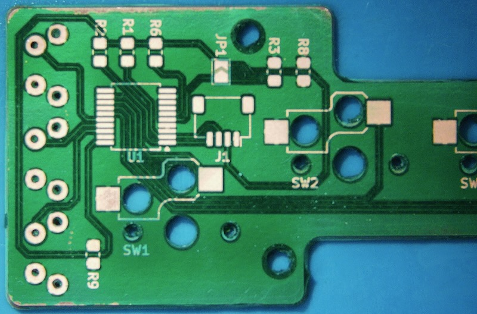

# fiber-laser-silkscreen-solder-mask-pcb

Fiber Laser Engraving Solder Mask and Silkscreen on DIY PCBs

A fiber laser can be incorporated in the final phase of making beautiful high gloss circuit boards at home.

This a three step process which involves: 

1. apply resin
2. engrave the silkscreen
3. engrave the pads

Video
===
** Click Image to Watch **

Why add these layers to prototypes?
===
1. Lasts Longer - It will not be exposed to nearly as much oxidation or at risk from accidental trace scratches.

2. Stronger - Single sided FR1 boards are typically 1.5mm thick. They can be snapped with your bare hands.

3. Assembly - Stuffing is easier with orientation, component labels and reduced risk of bridging between pads with the solder mask in place.

4. Kind of professional - A raw board looks like cool, but not nearly as good as one with the silkscreen + mask layers.

5. Quick - It doesn't take that long. Once you get the process down you can complete the silkscreen + mask layers in less than 20 minutes. 

Bill of Materials
===
| Product                                                         | Vendor | Price    |
| --------------------------------------------------------------- | ------ | -------- |
| [xTool F1 Ultra 20W Fiber](https://amzn.to/41h2cZH)             | Amazon | $4,200|
| [10W UV Light](https://amzn.to/4j4IIye)                          | Amazon | $15|
| [UV Soldermask](https://amzn.to/42o9AC1)                         | Amazon | $11|
| [Transparency Film](https://amzn.to/4jm4ahU)                     | Amazon | $13|
| [Gloves Anti-Static](https://amzn.to/3X36cKU)                    | Amazon | $18|

Acknowledgements
===
Special thanks to this excellent project for silk / mask settings I'm using and the 3D printed jig. 

* [Stephen Hawes Fiber Laser PCB Fab](https://github.com/sphawes/fiber-laser-pcb-fab)
